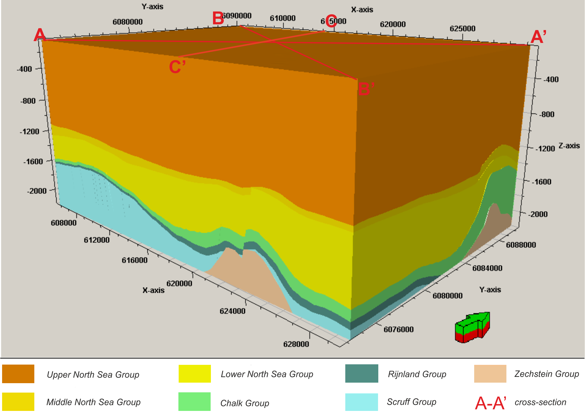

# Attention-based self-calibrated convolution neural network for efficient facies classification

 [Motaz Alfarraj](http://www.motaz.xyz)


[](https://zenodo.org/badge/latestdoi/165411165)


This repository includes the codes for the paper: 

'**Attention-based self-calibrated convolution neural network for efficient facies classification**' that is published in the SEG/AAPG International Meeting for Applied Geoscience & Energy, Houston, Texas, August 2024. [[Link]]([https://library.seg.org/doi/10.1190/INT-2018-0249.1](https://onepetro.org/SEGAM/proceedings-abstract/IMAGE24/IMAGE24/620897))

The code is forked from [[Facies Classification Benchmark]] (https://github.com/yalaudah/facies_classification_benchmark)

--------



## Abstract
Recent advances in deep learning and computer vision have resulted in giant leaps in automating some of the cumbersome oil and gas exploration and production operations. Deep convolutional neural networks have been widely used for seismic interpretation tasks including detection, classification, and segmentation of various subsurface geological phenomena. The downside of deep neural networks is that their data requirements increase heavily as their complexity increases. Although seismic data is abundantly available, such networks require annotated data which is an expensive and time-consuming process. In this work, we present a deep model for facies classification that leverages an attention-based self-calibrated convolution to achieve superior results while maintaining a relatively low model complexity. The model was trained and tested on a publicly available dataset for facies classification based on the Netherlands F3 block \cite[]{dataset}. The proposed model outperforms other models in the literature for facies classification while maintaining a lower complexity in terms of the number of parameters and the multiply-accumulate operations of the model. 


## Dataset

To download the training and testing data, run the following commands in the terminal: 

```bash
# download the files: 
wget https://zenodo.org/record/3755060/files/data.zip
# check that the md5 checksum matches: 
openssl dgst -md5 data.zip # Make sure the result looks like this: MD5(data.zip)= bc5932279831a95c0b244fd765376d85, otherwise the downloaded data.zip is corrupted. 
# unzip the data:
unzip data.zip 
# create a directory where the train/val/test splits will be stored:
mkdir data/splits
```

Alternatively, you can click [here](https://zenodo.org/record/3755060/files/data.zip) to download the data directly. Make sure you have the following folder structure in the `data` directory after you unzip the file: 

```bash
data
├── splits
├── test_once
│   ├── test1_labels.npy
│   ├── test1_seismic.npy
│   ├── test2_labels.npy
│   └── test2_seismic.npy
└── train
    ├── train_labels.npy
    └── train_seismic.npy
```

The train and test data are in NumPy `.npy` format ideally suited for Python. You can open these file in Python as such: 

```python
import numpy as np
train_seismic = np.load('data/train/train_seismic.npy')
```

**Make sure the testing data is only used once after all models are trained. Using the test set multiple times makes it a validation set.**


## Citation: 

If you have found our code useful, we kindly ask you to cite our work. You can cite the following: 
```tex
@inproceedings{alfarraj2024attention,
  title={Attention-based self-calibrated convolution neural network for efficient facies classification},
  author={Alfarraj, Motaz},
  booktitle={SEG International Exposition and Annual Meeting},
  pages={SEG--2024},
  year={2024},
  organization={SEG}
}

```
